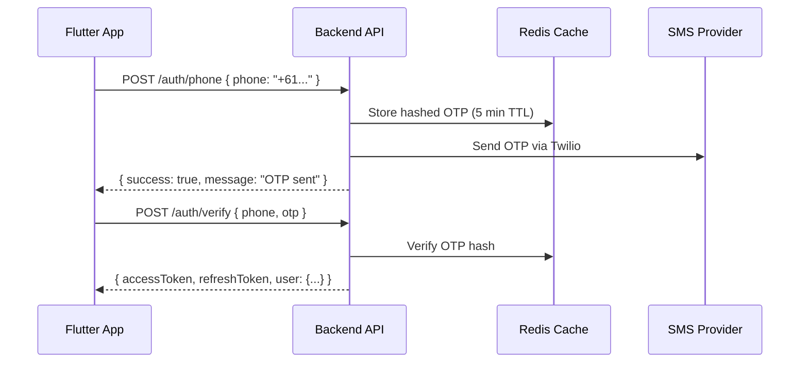
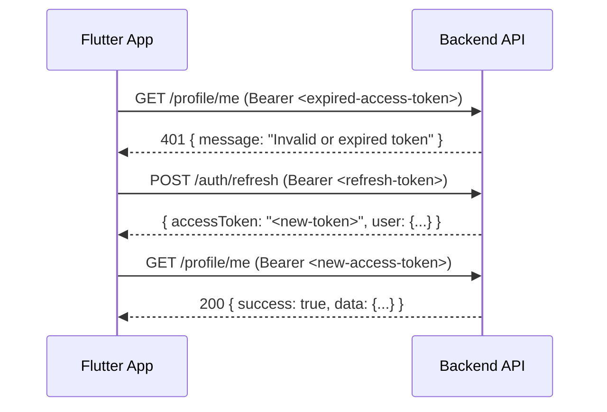

# 📚 MAFS Backend — Developer Documentation

**Version:** 1.0  
**Date:** 11 May 2026  
**Author:** Backend Team  

---

# Part 1: 🔐 Authentication & Token Lifecycle

## 1. Authentication Methods

MAFS supports 3 login methods:

| Method | Endpoint | Flow |
|--------|----------|------|
| **Phone OTP** | `POST /api/v1/auth/phone` → `POST /api/v1/auth/verify` | Send SMS → Enter 6-digit OTP |
| **Email OTP** | `POST /api/v1/auth/register/email` → `POST /api/v1/auth/verify/email` | Send email → Enter 6-digit OTP |
| **Social Login** | `POST /api/v1/auth/social/login` | Google / Apple / Facebook token verification |

## 2. Token Architecture

MAFS uses a **dual-token system** (Access + Refresh):

| Token | Format | Expiry | Storage | Purpose |
|-------|--------|--------|---------|---------|
| **Access Token** | JWT (signed with HS256) | **15 days** | Client memory / secure storage | Authenticate every API call |
| **Refresh Token** | Random 96-character hex string | **30 days** | Client secure storage + DB (hashed) | Get a new Access Token when expired |

### Access Token JWT Payload

```json
{
  "userId": "664f1a2b3c4d5e6f7a8b9c0d",
  "role": "user",
  "iat": 1715421600,
  "exp": 1716717600
}
```

| Field | Type | Description |
|-------|------|-------------|
| `userId` | String | MongoDB ObjectId of the user |
| `role` | String | `"user"` or `"admin"` |
| `iat` | Number | Issued at (Unix timestamp) |
| `exp` | Number | Expiry (Unix timestamp) |

## 3. Complete Auth Flow

### 3.1 Phone OTP Login (Primary Flow)



### 3.2 Email OTP Verification

> **Prerequisite:** User must have a valid Access Token (phone verified first).

```
Step 1: POST /auth/register/email  (Header: Bearer <accessToken>, Body: { email })
        → Backend sends 6-digit OTP to email
        → OTP valid for 10 minutes

Step 2: POST /auth/verify/email   (Header: Bearer <accessToken>, Body: { otp })
        → Returns updated user object with isEmailVerified: true
```

### 3.3 Social Login

```
POST /auth/social/login
Body: {
  "provider": "google" | "apple" | "facebook",
  "accessToken": "<provider-oauth-token>",
  "idToken": "<apple-id-token>"  // Apple only
}

Response: { accessToken, refreshToken, user: {...} }
```

## 4. Token Refresh Flow

When the Access Token expires, the app should **automatically refresh** it using the Refresh Token:



### Refresh Token Rules

| Rule | Detail |
|------|--------|
| Sent as | `Authorization: Bearer <refreshToken>` header |
| Max active tokens per user | **5** (oldest auto-removed when 6th created) |
| Expired tokens | Auto-cleaned on every refresh call |
| On invalid/expired refresh | Returns `401` — user must re-login |
| Token storage in DB | **SHA-256 hashed** (raw token never stored) |

## 5. Session Management

| Feature | Detail |
|---------|--------|
| Max devices per user | **5 simultaneous sessions** |
| New device login | If 6th device logs in, oldest session is removed |
| Session tracking | Device ID, device name, platform, OS, IP, last used |
| Login history | Last **15 login events** stored per user |

## 6. OTP Configuration

| Setting | Value |
|---------|-------|
| OTP length | **6 digits** (numeric) |
| Phone OTP validity | **5 minutes** (300 seconds) |
| Email OTP validity | **10 minutes** (600 seconds) |
| Max OTP verification attempts | **5** (then blocked until OTP expires) |
| OTP storage | **Redis** (hashed with bcrypt, salt=4) |

## 7. Error Codes & Handling

### HTTP Status Codes

| Status | Meaning | Frontend Action |
|--------|---------|-----------------|
| `401` | Token missing, invalid, or expired | Try refresh → if fails, redirect to login |
| `403` | Account banned / suspended / deactivated | Show specific message from response |
| `429` | Rate limited | Show "Please wait" message |

### Error Response Examples

**Token Expired (401):**
```json
{
  "message": "Invalid or expired token"
}
```

**Account Banned (from verify):**
```json
{
  "success": false,
  "message": "Your account has been banned. Please contact support."
}
```

**Account Suspended (from verify):**
```json
{
  "success": false,
  "message": "Your account is suspended until 2026-05-20T00:00:00.000Z"
}
```

**OTP Expired:**
```json
{
  "success": false,
  "message": "OTP expired or invalid"
}
```

**Too Many OTP Attempts:**
```json
{
  "success": false,
  "message": "Too many invalid OTP attempts"
}
```

## 8. Flutter Implementation Guide

### Dio Interceptor for Auto Token Refresh

```dart
class AuthInterceptor extends Interceptor {
  final Dio dio;
  final AuthService authService;

  AuthInterceptor(this.dio, this.authService);

  @override
  void onError(DioException err, ErrorInterceptorHandler handler) async {
    if (err.response?.statusCode == 401) {
      try {
        // Try refreshing the token
        final newToken = await authService.refreshToken();
        
        if (newToken != null) {
          // Retry the failed request with new token
          err.requestOptions.headers['Authorization'] = 'Bearer $newToken';
          final response = await dio.fetch(err.requestOptions);
          return handler.resolve(response);
        }
      } catch (e) {
        // Refresh failed — force re-login
        authService.logout();
        navigatorKey.currentState?.pushNamedAndRemoveUntil('/login', (_) => false);
      }
    }
    
    if (err.response?.statusCode == 429) {
      // Rate limited — show user-friendly message
      showToast("Please wait a moment before trying again");
    }
    
    return handler.next(err);
  }
}
```

### Token Storage Best Practice

```dart
// Use flutter_secure_storage for tokens
final storage = FlutterSecureStorage();

// After login/verify:
await storage.write(key: 'accessToken', value: response.accessToken);
await storage.write(key: 'refreshToken', value: response.refreshToken);

// On API calls:
final token = await storage.read(key: 'accessToken');
dio.options.headers['Authorization'] = 'Bearer $token';
```

---

# Part 2: 📁 File Upload Limits & Rules

## 1. Upload Endpoints Overview

| Endpoint | Purpose | Auth Required | Field Name |
|----------|---------|---------------|------------|
| `POST /api/v1/profile/photos` | Profile photos (up to 6) | ✅ | `photos` |
| `POST /api/v1/profile/selfie` | Selfie verification | ✅ | `selfie` |
| `POST /api/v1/profile/id-document` | KYC ID document | ✅ | `front`, `back` |
| `POST /api/v1/chat/upload-media` | Chat media (images/videos/GIFs) | ✅ | `media` |
| POST /api/v1/admin/upload/image | Admin icon upload | ✅ (Admin) | `file` |

## 2. Profile Photo Upload

| Setting | Value |
|---------|-------|
| **Endpoint** | `POST /api/v1/profile/photos` |
| **Field name** | `photos` |
| **Max files** | **6 photos per request** |
| **Max file size** | **5 MB per file** |
| **Total max per user** | 6 photos total |
| **Allowed formats** | JPEG, PNG, WebP, GIF |
| **Allowed MIME types** | `image/jpeg`, `image/png`, `image/webp`, `image/gif` |
| **Upload method** | `multipart/form-data` |
| **Storage** | Cloudinary (`dating-app/` folder) |
| **Rate limit** | 10 uploads per hour |

### Request Example
```
POST /api/v1/profile/photos
Content-Type: multipart/form-data
Authorization: Bearer <token>

photos: [file1.jpg, file2.png, ...]
```

## 3. Selfie Verification Upload

| Setting | Value |
|---------|-------|
| **Endpoint** | `POST /api/v1/profile/selfie` |
| **Field name** | `selfie` |
| **Max files** | **1 file** |
| **Max file size** | **5 MB** |
| **Allowed formats** | JPEG, PNG, WebP |
| **Rate limit** | 5 uploads per hour |

## 4. ID Document Upload (KYC)

| Setting | Value |
|---------|-------|
| **Endpoint** | `POST /api/v1/profile/id-document` |
| **Field names** | `front` (1 file) + `back` (1 file) |
| **Max files** | **2 total** (1 front + 1 back) |
| **Max file size** | **5 MB per file** |
| **Allowed formats** | JPEG, PNG, WebP |
| **Rate limit** | 3 uploads per hour |

### Request Example
```
POST /api/v1/profile/id-document
Content-Type: multipart/form-data
Authorization: Bearer <token>

front: [front-of-id.jpg]
back: [back-of-id.jpg]
```

## 5. Chat Media Upload ⭐

Chat has the most advanced upload system with **per-type size limits**:

| File Type | Max Size | Allowed Formats |
|-----------|----------|-----------------|
| **Image** | **10 MB** | JPEG, PNG, WebP, HEIC, HEIF |
| **Video** | **25 MB** | MP4, MOV (QuickTime), WebM |
| **GIF** | **8 MB** | GIF |

| Setting | Value |
|---------|-------|
| **Endpoint** | `POST /api/v1/chat/upload-media` |
| **Field name** | `media` |
| **Max files per message** | **5 files** |
| **Rate limit** | 10 uploads per minute |

### iPhone-Specific Notes

| iPhone Format | Typical Size | Supported |
|--------------|-------------|-----------|
| HEIC Photo | 2–5 MB | ✅ Yes |
| JPEG Photo | 3–8 MB | ✅ Yes |
| 1080p Video (10 sec) | 10–15 MB | ✅ Yes |
| 4K Video (10 sec) | 40–50 MB | ❌ Too large — compress to 1080p before upload |

### Request Example
```
POST /api/v1/chat/upload-media
Content-Type: multipart/form-data
Authorization: Bearer <token>

media: [photo1.jpg, video.mp4, reaction.gif]
```

## 6. Error Responses

### File Too Large
```json
{
  "success": false,
  "message": "File too large. Max size is 5MB."
}
```

### Chat — File Too Large (with per-type limits)
```json
{
  "success": false,
  "errorCode": "FILE_TOO_LARGE",
  "message": "File too large. Max size: Images 10 MB, Videos 25 MB, GIFs 8 MB.",
  "limits": {
    "image": "10 MB",
    "video": "25 MB",
    "gif": "8 MB"
  }
}
```

### Too Many Files
```json
{
  "success": false,
  "errorCode": "TOO_MANY_FILES",
  "message": "Maximum 5 files per message allowed.",
  "maxFiles": 5
}
```

### Invalid File Type
```json
{
  "success": false,
  "errorCode": "INVALID_FILE_TYPE",
  "message": "Unsupported file type: application/pdf. Allowed: JPEG, PNG, WebP, HEIC, GIF, MP4, MOV, WebM.",
  "allowedTypes": {
    "images": ["JPEG", "PNG", "WebP", "HEIC"],
    "gifs": ["GIF"],
    "videos": ["MP4", "MOV", "WebM"]
  }
}
```

### Wrong Field Name
```json
{
  "success": false,
  "message": "Unexpected field. Use 'photos' & max 6 files."
}
```

## 7. Quick Reference Table

| Upload Type | Field | Max Size | Max Files | Formats | Rate Limit |
|------------|-------|----------|-----------|---------|------------|
| Profile Photos | `photos` | 5 MB | 6 | JPEG, PNG, WebP, GIF | 10/hr |
| Selfie | `selfie` | 5 MB | 1 | JPEG, PNG, WebP | 5/hr |
| ID Document | `front`, `back` | 5 MB each | 2 | JPEG, PNG, WebP | 3/hr |
| Chat Image | `media` | 10 MB | 5 | JPEG, PNG, WebP, HEIC | 10/min |
| Chat Video | `media` | 25 MB | 5 | MP4, MOV, WebM | 10/min |
| Chat GIF | `media` | 8 MB | 5 | GIF | 10/min |
| Admin Image | `file` | 5 MB | 1 | JPEG, PNG, WebP | — |

## 8. Flutter Upload Example

```dart
Future<void> uploadProfilePhotos(List<File> photos) async {
  final formData = FormData();
  
  for (var photo in photos) {
    // Validate size before uploading
    final sizeInMB = photo.lengthSync() / (1024 * 1024);
    if (sizeInMB > 5) {
      throw Exception('File ${photo.path} exceeds 5 MB limit');
    }
    
    formData.files.add(MapEntry(
      'photos',  // ← Must match backend field name exactly
      await MultipartFile.fromFile(photo.path),
    ));
  }
  
  final response = await dio.post(
    '/api/v1/profile/photos',
    data: formData,
    options: Options(
      headers: {'Authorization': 'Bearer $accessToken'},
      contentType: 'multipart/form-data',
    ),
  );
}
```

---

> **Questions?** Contact the Backend Team for any clarifications or changes.
