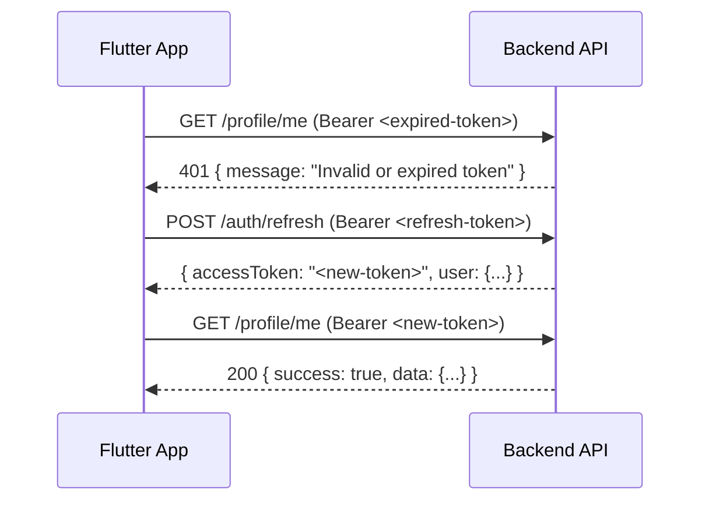

# 🛡️ MAFS Backend — API Standard Documentation

**Version:** 1.1  
**Date:** 11 May 2026  
**Author:** Backend Team  
**Status:** ✅ Consolidated & Live  

---

## 📌 Overview
This document serves as the **single source of truth** for the MAFS API integration. It covers security protocols (Rate Limiting), session management (Authentication), and data constraints (File Uploads).

---

# Part 1: 🔐 Authentication & Token Lifecycle

## 1. Authentication Methods
MAFS supports 3 login methods:

| Method | Endpoint | Flow |
|--------|----------|------|
| **Phone OTP** | `POST /api/v1/auth/phone` → `POST /api/v1/auth/verify` | Send SMS → Enter 6-digit OTP |
| **Email OTP** | `POST /api/v1/auth/register/email` → `POST /api/v1/auth/verify/email` | Send email → Enter 6-digit OTP |
| **Social Login** | `POST /api/v1/auth/social/login` | Google / Apple / Facebook token verification |

## 2. Token Architecture
MAFS uses a **dual-token system** (Access + Refresh):

| Token | Format | Expiry | Purpose |
|-------|--------|--------|---------|
| **Access Token** | JWT (signed with HS256) | **15 days** | Authenticate every API call |
| **Refresh Token** | Random 96-char hex string | **30 days** | Get a new Access Token when expired |

### Access Token JWT Payload
```json
{
  "userId": "664f1a2b3c4d5e6f7a8b9c0d",
  "role": "user",
  "iat": 1715421600,
  "exp": 1716717600
}
```

## 3. Token Refresh Flow
When the Access Token expires (returns `401`), the app must automatically call the refresh endpoint:



## 4. Session & OTP Rules
- **Max devices:** 5 simultaneous sessions (oldest is removed on 6th login).
- **OTP Length:** 6 digits.
- **OTP Validity:** 5 min (Phone), 10 min (Email).
- **Max Attempts:** 5 failed attempts blocks the OTP.

---

# Part 2: 🛡️ API Rate Limiting

Rate limiting is enforced via **Redis** to prevent abuse and brute-force attacks. Exceeding limits returns **`429 Too Many Requests`**.

## 1. Auth & Social (Security Critical)
| Endpoint | Limit | Window | Tracked By | Why |
|----------|-------|--------|------------|-----|
| `/auth/phone` | 3 requests | 5 min | IP/UID | Prevents SMS spam |
| `/auth/verify` | 5 requests | 5 min | IP/UID | Prevents brute-force |
| `/auth/social/login` | 10 requests | 5 min | IP/UID | Prevents credential stuffing |

## 2. Profile & Discovery
| Endpoint | Limit | Window | Tracked By | Why |
|----------|-------|--------|------------|-----|
| `/profile/me` | 30 requests | 1 min | UID | Polling control |
| `/profile/update` | 40 requests | 1 hr | UID | Bulk update prevention |
| `/profile/:userId` | 60 requests | 1 min | UID | Data scraping prevention |
| `/profile/location` | 20 requests | 1 min | UID | Spoofing prevention |

## 3. Swipe & Chat (Core Features)
| Endpoint | Limit | Window | Tracked By | Why |
|----------|-------|--------|------------|-----|
| `/swipe/feed` | 30 requests | 1 min | UID | Harvesting prevention |
| `/swipe/action` | 40 requests | 1 min | UID | Anti-bot / Fair usage |
| `/chat/send` | 30 requests | 1 min | UID | Spam / Flooding control |
| `/chat/upload-media` | 10 requests | 1 min | UID | Resource protection |

## 4. Sensitive Actions
| Endpoint | Limit | Window | Tracked By | Why |
|----------|-------|--------|------------|-----|
| `/giveaway/claim` | 3 requests | 1 min | UID | **Fraud prevention** |
| `/account/delete` | 2 requests | 24 hr | UID | Destructive action |
| `/boost/activate` | 3 requests | 1 hr | UID | Feature abuse |
| `/contacts/import` | 3 requests | 1 hr | UID | Heavy server load |

---

# Part 3: 📁 File Upload Rules

| Category | Endpoint | Max Size | Max Files | Formats |
|----------|----------|----------|-----------|---------|
| **Profile Photos** | `/profile/photos` | 5 MB | 6 | JPG, PNG, WebP, GIF |
| **ID Documents** | `/profile/id-document` | 5 MB each | 2 | JPG, PNG, WebP |
| **Chat Images** | `/chat/upload-media` | 10 MB | 5 | JPG, PNG, WebP, HEIC |
| **Chat Videos** | `/chat/upload-media` | 25 MB | 5 | MP4, MOV, WebM |
| **Chat GIFs** | `/chat/upload-media` | 8 MB | 5 | GIF |

### ⚠️ Important Upload Notes
- **Multipart Fields:** Profile uses `photos`; KYC uses `front` and `back`; Chat uses `media`.
- **HEIC Support:** Only supported in Chat module (for iPhone users).
- **Video Limit:** 25MB is enough for ~15 sec of 1080p. Users should compress 4K videos before upload.

---

# Part 4: 📱 Frontend Implementation Guide

## 1. Handling 429 & 401 Globally
The app should use an interceptor to handle these status codes centrally.

```dart
// Flutter Example (Dio Interceptor)
if (response.statusCode == 429) {
  showSnackBar("Doing this too fast! Please wait a moment.");
}

if (response.statusCode == 401) {
  // 1. Try silent refresh with refresh token
  // 2. If refresh fails, log out and redirect to login
}
```

## 2. Upload Best Practices
```dart
Future<void> uploadPhotos(List<File> files) async {
  final formData = FormData();
  for (var file in files) {
    if (file.lengthSync() > 5 * 1024 * 1024) throw "File too large!";
    formData.files.add(MapEntry('photos', await MultipartFile.fromFile(file.path)));
  }
  await dio.post('/api/v1/profile/photos', data: formData);
}
```

---

## ⚙️ Technical Summary
- **Storage:** Redis (Limits) + Cloudinary (Files) + MongoDB (Sessions).
- **Reliability:** Fail-open strategy (if Redis is down, API stays open).
- **Scaling:** Distributed ready (works across multiple EC2 instances).

---

> **Questions?** Reach out to the Backend Team.
