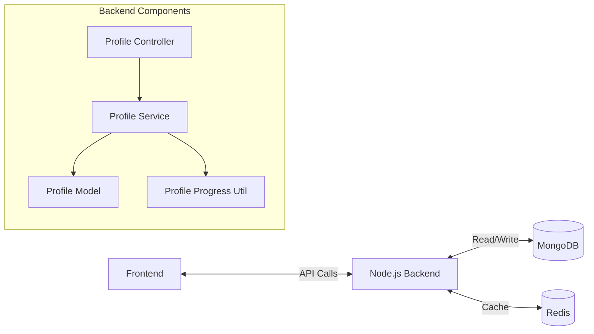
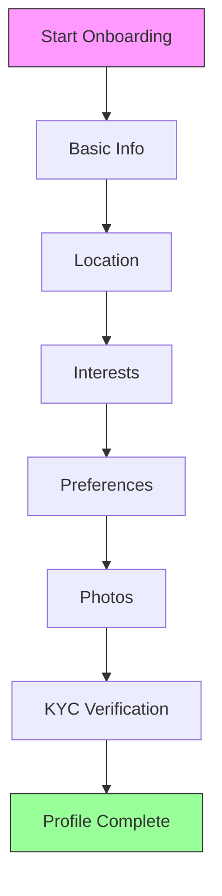

# Profile Completion System

## 🏗️ Architecture Overview



## 🔍 In-Depth Technical Flow

1. **Initialization**
   - When a user signs up, a basic profile document is created in MongoDB with default values
   - The `onboardingProgress` field tracks completion status of each step

2. **Progress Tracking**
   - Each user action (saving info, uploading photos, etc.) updates the profile
   - The `updateProfileProgress` utility function is called after each update
   - Progress is calculated based on completed steps and their weights

3. **Caching Layer**
   - Redis caches the status for 30 seconds to reduce database load
   - Cache is invalidated after any profile update



## 🛠️ Backend Implementation Details

### 1. Profile Model Structure
```javascript
// profile.model.js
const ProfileSchema = new mongoose.Schema({
  userId: { type: mongoose.Schema.Types.ObjectId, ref: 'User', required: true },
  // ... other fields ...
  onboardingProgress: {
    basicInfo: { type: Boolean, default: false },
    location: { type: Boolean, default: false },
    interestsSelected: { type: Boolean, default: false },
    preferencesSet: { type: Boolean, default: false },
    photosUploaded: { type: Boolean, default: false },
    kycVerified: { type: Boolean, default: false },
    completion: { type: Number, default: 0 }
  },
  // ... other fields ...
}, { timestamps: true });
```

### 2. Progress Calculation Logic
```javascript
// profileProgress.util.js
const STEP_WEIGHTS = {
  basicInfo: 20,
  location: 15,
  interestsSelected: 15,
  preferencesSet: 15,
  photosUploaded: 20,
  kycVerified: 15
};

function computeCompletion(progress) {
  let pct = 0;
  for (const [key, weight] of Object.entries(STEP_WEIGHTS)) {
    if (progress[key]) pct += weight;
  }
  return Math.min(100, pct);
}
```

### 3. API Endpoint: GET `/profile/status`

**Controller Implementation:**
```javascript
// profile.controller.js
exports.getStatus = async (req, res) => {
  try {
    const userId = req.user._id.toString();
    const cacheKey = `profile:status:${userId}`;

    // Check cache first
    const cached = await cache.get(cacheKey);
    if (cached) {
      return res.json({ success: true, progress: JSON.parse(cached) });
    }

    // Get from DB if not in cache
    const profile = await Profile.findOne({ userId }).lean();
    if (!profile) {
      const defaultProgress = {
        basicInfo: false, location: false, interestsSelected: false,
        preferencesSet: false, photosUploaded: false, kycVerified: false,
        completion: 0
      };
      await cache.set(cacheKey, JSON.stringify(defaultProgress), { EX: 30 });
      return res.json({ success: true, progress: defaultProgress });
    }

    const progress = profile.onboardingProgress || { completion: 0 };
    await cache.set(cacheKey, JSON.stringify(progress), { EX: 30 });
    return res.json({ success: true, progress });
  } catch (err) {
    console.error("getStatus error", err);
    return res.status(500).json({ success: false, message: err.message });
  }
};
```

**Example Response:**
```json
{
  "success": true,
  "progress": {
    "basicInfo": true,
    "location": true,
    "interestsSelected": true,
    "preferencesSet": false,
    "photosUploaded": false,
    "kycVerified": false,
    "completion": 50
  }
}
```

## Step Weights
Each completed step contributes to the overall completion percentage:

| Step | Field | Weight | Required Fields |
|------|-------|--------|-----------------|
| 1. Basic Info | `basicInfo` | 20% | fullName, dob, gender |
| 2. Location | `location` | 15% | coordinates (lat, lon) |
| 3. Interests | `interestsSelected` | 15% | 3+ interests |
| 4. Preferences | `preferencesSet` | 15% | ageRange, genderPreference |
| 5. Photos | `photosUploaded` | 20% | 1+ photos |
| 6. KYC | `kycVerified` | 15% | isKycVerified = true |

## 🔄 Frontend Integration Guide

### 1. Initial Load
```javascript
// 1. On app load or route change to onboarding
const fetchProfileStatus = async () => {
  try {
    const response = await fetch('/profile/status', {
      headers: { 'Authorization': `Bearer ${authToken}` }
    });
    const { progress } = await response.json();
    
    // Update UI with progress
    updateProgressBar(progress.completion);
    updateStepStatuses(progress);
    
    // Redirect to first incomplete step
    redirectToNextIncompleteStep(progress);
  } catch (error) {
    console.error('Failed to fetch profile status:', error);
  }
};
```

### 2. After Completing a Step
```javascript
// After successfully saving profile info
const handleSaveBasicInfo = async (formData) => {
  try {
    // 1. Save the data
    await fetch('/profile/basic', {
      method: 'POST',
      headers: { 'Content-Type': 'application/json' },
      body: JSON.stringify(formData)
    });
    
    // 2. Wait a moment for cache to update
    await new Promise(resolve => setTimeout(resolve, 500));
    
    // 3. Get updated status
    const statusResponse = await fetch('/profile/status');
    const { progress } = await statusResponse.json();
    
    // 4. Update UI
    updateProgressBar(progress.completion);
    
    // 5. Move to next step or show completion
    if (progress.completion === 100) {
      showCompletionScreen();
    } else {
      navigateToNextStep(progress);
    }
  } catch (error) {
    showError('Failed to save information');
  }
};
```

2. **After Each Step**
   - Make the appropriate API call (e.g., POST to `/profile/basic`)
   - On success, re-fetch status to update progress
   - Update UI to show completed steps

3. **Progress Bar**
   ```javascript
   // Example React component
   <ProgressBar now={progress.completion} />
   ```

4. **Step Indicators**
   ```javascript
   // Example step indicator
   steps.map(step => (
     <Step 
       key={step.id}
       completed={progress[step.field]}
       current={!progress[step.field] && !progress.completed}
     />
   ))
   ```

## Example User Flow
1. New user signs up (0% complete)
2. Completes basic info (20% complete)
3. Sets location (35% complete)
4. Selects interests (50% complete)
5. Sets preferences (65% complete)
6. Uploads photo (85% complete)
7. Completes KYC (100% complete)

## Error Handling
- Show appropriate error messages if API calls fail
- Disable next step until current step is complete
- Provide clear validation messages for each step

## 🚀 Performance Optimizations

### 1. Caching Strategy
- **Redis Cache**: Status is cached for 30 seconds
- **Cache Invalidation**: Automatically invalidated on profile updates
- **Frontend Cache**: Consider using React Query or SWR for client-side caching

### 2. Optimistic Updates
```javascript
// Example with React Query
const { data: progress, refetch } = useQuery('profileStatus', fetchStatus);

const updateProfile = useMutation(
  (formData) => api.updateProfile(formData),
  {
    onMutate: async (newData) => {
      // Optimistically update the UI
      await queryClient.cancelQueries('profileStatus');
      const previousStatus = queryClient.getQueryData('profileStatus');
      queryClient.setQueryData('profileStatus', old => ({
        ...old,
        progress: { ...old.progress, [step]: true }
      }));
      return { previousStatus };
    },
    onError: (err, newData, context) => {
      // Rollback on error
      queryClient.setQueryData('profileStatus', context.previousStatus);
    },
    onSettled: () => {
      // Always refetch after error or success
      queryClient.invalidateQueries('profileStatus');
    }
  }
);
```

## 🔍 Debugging Tips

1. **Check Cache Status**
   ```bash
   # Check Redis cache
   redis-cli keys 'profile:status:*'
   ```

2. **Force Cache Refresh**
   ```javascript
   // Add cache-busting parameter
   const response = await fetch('/profile/status?_=' + Date.now());
   ```

3. **Common Issues**
   - Cache not updating? Ensure you're waiting 500ms after updates
   - Progress not increasing? Check if all required fields are being saved
   - Steps not marking as complete? Verify the field names match exactly

## 📚 Additional Resources
- [Mongoose Documentation](https://mongoosejs.com/)
- [Redis Caching Patterns](https://redis.io/topics/patterntable)
- [React Query Documentation](https://react-query.tanstack.com/)

## 🚨 Troubleshooting

### Q: Why is my progress not updating?
A: Check:
1. Is the backend returning 200 with updated data?
2. Is the cache being properly invalidated?
3. Are all required fields being sent in the request?

### Q: Why is the progress percentage incorrect?
A: Verify the `STEP_WEIGHTS` in `profileProgress.util.js` add up to 100
